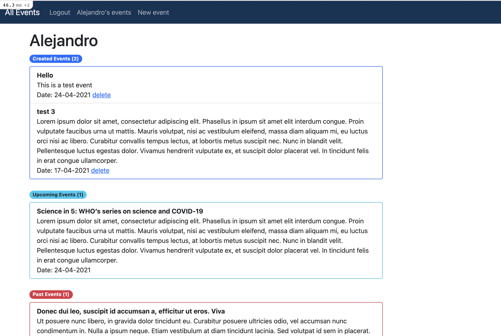

# Private Events

> This project is part of the Microverse Rails curriculum.

This project was made for learning proposes, to implement ActiveRecord’s associations using Ruby On Rails, so users can create events as well as assist them.

## Getting Started

**Keep in mind that it is preferable to run this program with the most up-to-date version of Ruby.**

If you want to play around with this project, follow these steps.

### Prerequisites

- Basic knowledge of the terminal of your computer
- Basic knowledge of git
- Ruby 2.6.0 or later version
- Github account
- Rails pre-installed

**If you don't have plenty of knowledge of one of these, here are some helpful links that can explain to you how to get and/or use them.**

**Terminal**
[- Basic guide](https://www.techrepublic.com/article/16-terminal-commands-every-user-should-know/)
 

**Git**
[- Basic guide](https://product.hubspot.com/blog/git-and-github-tutorial-for-beginners)
 

**Ruby**
[- Installation](https://www.ruby-lang.org/en/documentation/installation)
[- Quickstart](https://www.ruby-lang.org/en/documentation/quickstart/)
 

**Github**
[- Basic guide](https://guides.github.com/activities/hello-world/)
 

**Rails**
[- A playlist of videos that shows you how to install and use it](https://www.youtube.com/watch?v=iF8caVyDi5g&list=PLCC34OHNcOtrk3BDsfZwf4GattdLoKCOF)
 
 

### Setup and usage

 

> 1. Clone this repo into your computer

- Click on "Code" and copy the HTTPS URL
- Go to your terminal and type: 

      $ git clone (paste the URL direction)
 

- Now, change the folder direction, type: 

      $ cd private-events
 

> 2. Install Gems, run migration and the server on the terminal

- You will need to have some gems that are already in the Gemfile.
- In the Gemfile add 

      gem 'webpacker', '~> 6.x'
 

- Now in the terminal type and run:

      $ bundle install
 

- Now to migrate:

      $ rails db:migrate
 

- and finally, to run the server, type and enter:

      $ rails server
 

- Open the browser and go to the URL http://localhost:3000
- This is the main page. Now you should be able to see the events that had been created.
 
 

> 3. Create a user account and an event

- Click on Sign Up
- Now, just with your name create the account.
- You will be redirected to your events page.
 
 

> 4. Create an event.

- To create your event, click on New Event and fill out the form.
- Now this will redirect you to your events page, which will show your created, future and past events.
 
 

> 5. Assist to an event.

- All the events that users have created are listed on the main page. "All Events"
- You can see who will attend the event by clicking on the button "See Attendees" or attend the event by clicking on the link "Attend Event!"
 
 

## Built With

- Ruby 3.0.0
- Rails 6.1.3
- VsCode
- Github
- Git
   

## Author

👤 **Alejandro Guadalupe Contreras Rodriguez**

- GitHub: [@AlejandroNo4](https://github.com/AlejandroNo4)
- Twitter: [@Alejand80002666](https://twitter.com/alejand80002666)
- LinkedIn: [Alejandro Contreras Rodriguez](https://www.linkedin.com/in/alejandro-contreras-rodriguez-b524821b5/)

## 🤝 Contributing

Contributions, issues, and feature requests are welcome!

Feel free to check the [issues page](https://github.com/AlejandroNo4/private-events/issues).

## Show your support

Give a ⭐️ if you like this project!

## Acknowledgments

Information based on:

[- The Odin Project](https://www.theodinproject.com/paths/full-stack-ruby-on-rails/courses/ruby-on-rails/lessons/associations)

For a better understanding, I followed this simple tutorial from Colleen Schnettler.

[- has many through relationship in Rails](https://www.youtube.com/watch?v=15bbxWGTp6c&t=391s)